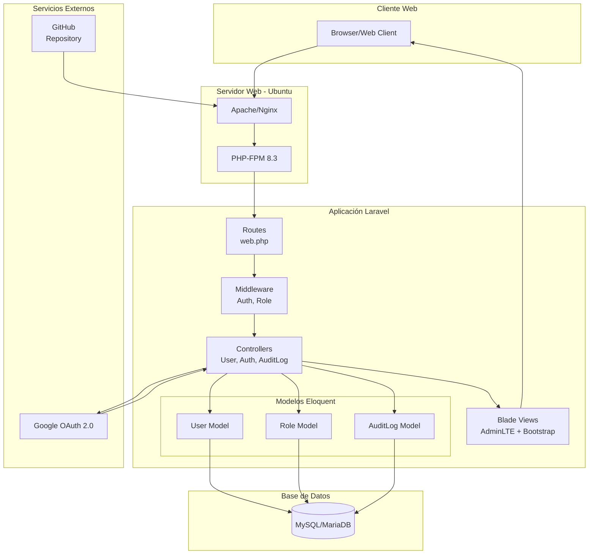
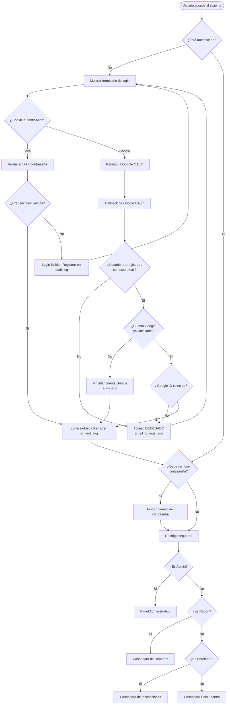
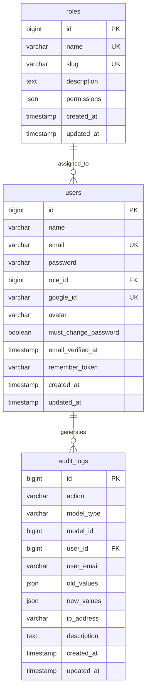
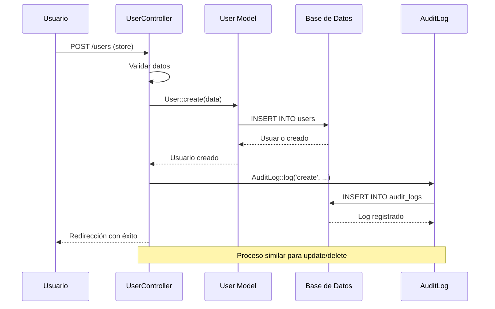
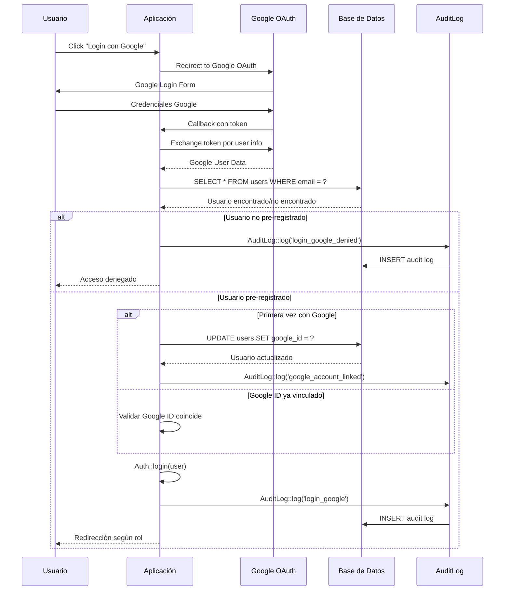
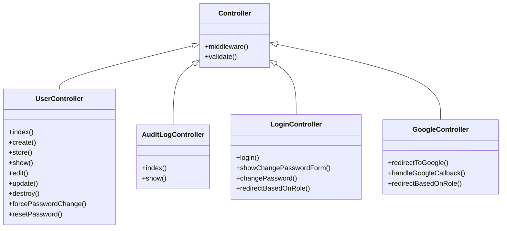
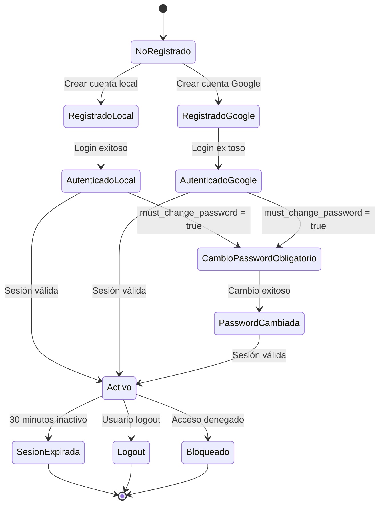
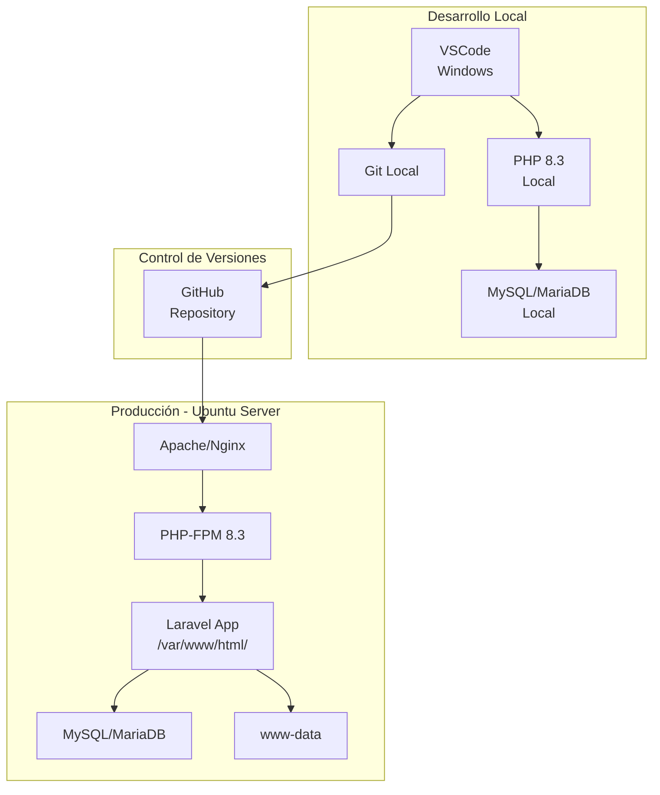

# Diagramas de Arquitectura - Sistema de Acreditación

## Diagrama de Arquitectura General



## Diagrama de Flujo de Autenticación



## Diagrama de Roles y Permisos

```mermaid
flowchart TD
    subgraph "Roles del Sistema"
        Admin[Administrador<br/>admin]
        ReadOnly[Solo Lectura<br/>solo-lectura]
        Report[Informe<br/>informe]
        Enroller[Enrolador<br/>enrolador]
    end

    subgraph "Permisos Administrador"
        ManageUsers[manage_users]
        ManageRoles[manage_roles]
        ViewReports[view_reports]
        ManageAccreditations[manage_accreditations]
        SystemSettings[system_settings]
    end

    subgraph "Permisos Solo Lectura"
        ViewData[view_data]
        ViewReports_RO[view_reports]
    end

    subgraph "Permisos Informe"
        ViewReports_R[view_reports]
        ExportReports[export_reports]
        GenerateCharts[generate_charts]
    end

    subgraph "Permisos Enrolador"
        ManageUsers_E[manage_users]
        ManageAccreditations_E[manage_accreditations]
        ViewReports_E[view_reports]
    end

    Admin --> ManageUsers
    Admin --> ManageRoles
    Admin --> ViewReports
    Admin --> ManageAccreditations
    Admin --> SystemSettings

    ReadOnly --> ViewData
    ReadOnly --> ViewReports_RO

    Report --> ViewReports_R
    Report --> ExportReports
    Report --> GenerateCharts

    Enroller --> ManageUsers_E
    Enroller --> ManageAccreditations_E
    Enroller --> ViewReports_E
```



## Diagrama de Base de Datos - Relaciones



## Diagrama de Secuencia - CRUD Usuario



## Diagrama de Secuencia - Login Google OAuth



## Diagrama de Componentes - Controladores



## Diagrama de Estados - Usuario



## Diagrama de Despliegue



## Diagrama de Seguridad - Capas de Protección

```mermaid
flowchart TD
    subgraph "Capa de Red"
        HTTPS[HTTPS/SSL]
        Firewall[Firewall]
        RateLimit[Rate Limiting]
    end

    subgraph "Capa de Aplicación"
        CSRF[CSRF Protection]
        Validation[Input Validation]
        Sanitization[Data Sanitization]
    end

    subgraph "Capa de Autenticación"
        Session[Session Management<br/>30 min timeout]
        OAuth[Google OAuth<br/>Pre-registered only]
        Password[Password Hashing<br/>bcrypt]
    end

    subgraph "Capa de Autorización"
        Middleware[Role Middleware]
        Permissions[Permission Checks]
        ACL[Access Control Lists]
    end

    subgraph "Capa de Auditoría"
        AuditLogs[Complete Audit Trail]
        IPTracking[IP Address Logging]
        ChangeTracking[Before/After Values]
    end

    HTTPS --> CSRF
    Firewall --> Validation
    RateLimit --> Sanitization

    CSRF --> Session
    Validation --> OAuth
    Sanitization --> Password

    Session --> Middleware
    OAuth --> Permissions
    Password --> ACL

    Middleware --> AuditLogs
    Permissions --> IPTracking
    ACL --> ChangeTracking